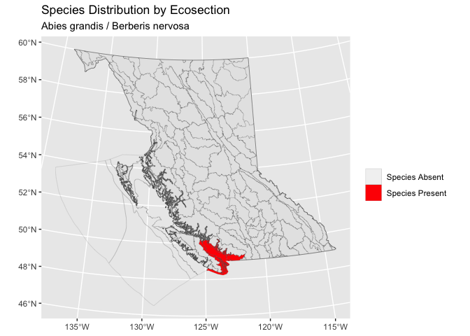

<!-- README.md is generated from README.Rmd. Please edit that file -->

# bcspecies

<!-- badges: start -->

[](https://www.tidyverse.org/lifecycle/#experimental)
[](https://opensource.org/licenses/MIT)
<!-- badges: end -->

bcspecies provides a cleaned BC Species dataset and functions to map
distrbution by ecosection and view conservation status for species in
British Columbia, Canada.

## Installation

To install the developmental version from
[GitHub](https://github.com/GinKampen/bcspecies)

``` r
# install.packages("remotes")
remotes::install_github("GinKampen/bcspecies")
```

## Demonstration

View first 5 species names in dataset

``` r
library(bcspecies)
bc_species$ScientificName[1:5]
#> [1] "Abies amabilis - Thuja plicata / Rubus spectabilis Moist Maritime 1"  
#> [2] "Abies amabilis - Thuja plicata / Tiarella trifoliata Moist Maritime 1"
#> [3] "Abies grandis / Berberis nervosa"                                     
#> [4] "Abies grandis / Tiarella trifoliata"                                  
#> [5] "Abronia umbellata var. breviflora"
```

Map distribution by ecosection of *Anemone occidentalis - Carex
nigricans*

``` r
species <- "Abies grandis / Berberis nervosa"
species_map(species)
```



Get conservation status

``` r
conservation_status(species)
#> # A tibble: 1 x 3
#>   BCList `COSEWIC Status` `Implemented Date` 
#>   <chr>  <chr>            <dttm>             
#> 1 Red    No Status        NA
```

## Contribution

Please report any
[issues](https://github.com/GinKampen/bcspecies/issues).

[Pull requests](https://github.com/GinKampen/bcspecies/pulls) are always
welcome.

### Code of Conduct

Please note that the pkgtemplate project is released with a [Contributor
Code of
Conduct](https://www.contributor-covenant.org/version/1/0/0/code-of-conduct/).
By contributing to this project, you agree to abide by its terms.
